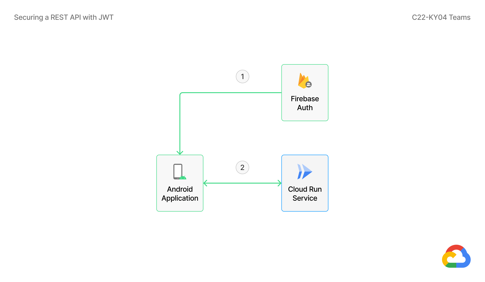
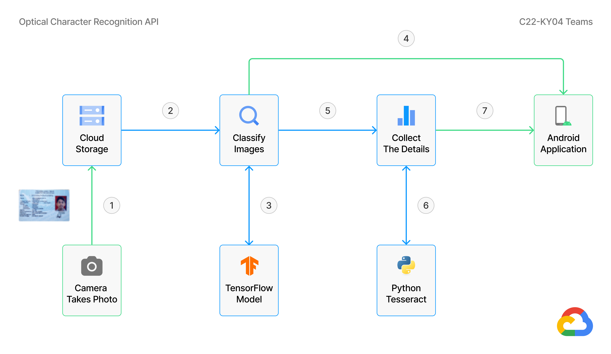
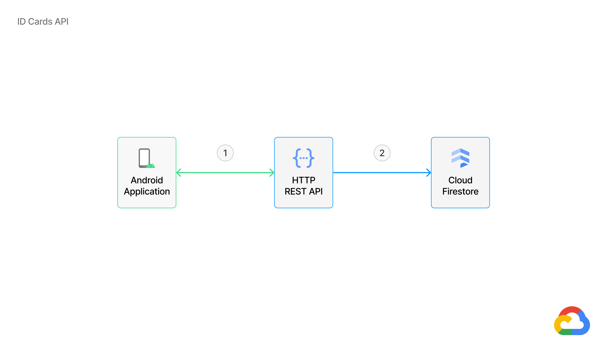

## Cloud Architecture Diagram


See more detail [here](https://www.figma.com/file/bXdu32FvMX29idjgUkxKXN/Google-Cloud-Diagram?node-id=0%3A1)

<br><br>

## Billing Cost
Estimated billing cost that's used in this projects:
<table>
  <tr>
    <td>Services</td>
    <td>Price</td>
  </tr>
  <tr>
    <td>Cloud Run</td>
    <td>IDR 0</td>
  </tr>
  <tr>
    <td>Cloud Storage</td>
    <td>IDR 33,502.95</td>
  </tr>
  <tr>
    <td>Cloud Build</td>
    <td>IDR 0</td>
  </tr>
  <tr>
    <td>Firestore</td>
    <td>IDR 11,187.07</td>
  </tr>
  <tr>
    <td>Total</td>
    <td>IDR 44,690.02</td>
  </tr>
</table>

See more detail [here](https://cloud.google.com/products/calculator/#id=05305aa6-1fa2-442f-9ebc-2b7ed1af4125)

<br><br>

## Securing a REST API with JWT



Description:
1. Firebase Authentication will send JWT token to Android Application.
2. Android Application will send the JWT token to the Cloud Run Service. Then Cloud Run Service will validate the token, so only authenticated users can make requests.

<br><br>

## Optical Character Recognition API

Create REST API using [Python](https://www.python.org/), [Flask](https://flask.palletsprojects.com/en/2.1.x/), [TensorFlow](https://www.tensorflow.org), [Cloud Run](https://cloud.google.com/run), and [Cloud Storage](https://cloud.google.com/storage)

### Workflow



Description:
1. Upload to Google Cloud Storage Bucket using HTTP Request Method `POST`.
2. Download images from Google Cloud Storage Bucket.
3. Classify images using TensorFlow, whether the image is ID card or not.
4. If the image is not an ID card (KTP), then immediately return the results to the Android Application.
5. If the image is an ID card (KTP), then proceed to collect the details.
6. Collect ID Card (KTP) details using PyTesseract (Python Tesseract).
7. Then send the results to the Android Application for re-validation.

### Base URL

https://ocr-api-5igfi42iaq-et.a.run.app

Response `string`

```json
"Hello from Optical Character Recognition API, C22-KY04."
```

### Routing

**POST** &nbsp;&nbsp; `/ocr`

This method allows you to classify an image as ID card or not and extract data on ID card.

Authentication

- [x] ID Tokens

Headers

<table>
  <tr>
    <td>Authorization</td>
    <td>string</td>
    <td>Bearer &lt;ID Tokens&gt;</td>
    <td><b>required</b></td>
  </tr>
</table>

Request Body &nbsp;&nbsp; `multipart/form-data`

<table>
  <tr>
    <td>file</td>
    <td>File</td>
    <td>png&nbsp;/&nbsp;jpg&nbsp;/&nbsp;jpeg</td>
    <td><b>required</b></td>
  </tr>
</table>

Response &nbsp;&nbsp; `application/json`

HTTP Response Status Codes  &nbsp;&nbsp; **201**

```json
{
    "status": "OK",
    "message": "Successfully extract data with OCR.",
    "data": {
        "province": "JAWA TIMUR",
        "district": "KABUPATEN SIDOARJO",
        "id_number": "351XXXXXXXXXXXXX",
        "name": "MOCHAMMAD ARYA SALSABILA",
        "place_date_of_birth": "SIDOARJO, 24-06-2001",
        "gender": "LAKI-LAKI",
        "blood_type": "-",
        "address": "NGABAN",
        "neighborhood": "005/002",
        "village": "NGABAN",
        "subdistrict": "TANGGULANGIN",
        "religion": "ISLAM",
        "marital_status": "BELUM KAWIN",
        "occupation": "PELAJAR/MAHASISWA",
        "nationality": "WNI",
        "expiry_date": "SEUMUR HIDUP",
        "attachment": "https://storage.googleapis.com/id-cards-photo/04062022-090807.png"
    }
}
```

HTTP Response Status Codes  &nbsp;&nbsp; **400**

```json
{
    "status": "Bad Request",
    "message": "No token provided."
}
```

```json
{
    "status": "Bad Request",
    "message": "No file part."
}
```

```json
{
    "status": "Bad Request",
    "message": "No selected file."
}
```

HTTP Response Status Codes  &nbsp;&nbsp; **406**

```json
{
    "status": "Not Acceptable",
    "message": "Only files with extension png, jpg, jpeg are allowed."
}
```

```json
{
    "status": "Not Acceptable",
    "message": "That's not an Indonesian ID Card (KTP). Please try again."
}
```

HTTP Response Status Codes  &nbsp;&nbsp; **500**

```json
{
    "status": "Internal Server Error",
    "message": "Error message..."
}
```

<br><br>

## ID Cards API

Create a REST API using [Node.js](https://nodejs.org/en/), [Express](https://expressjs.com/), [Firebase Auth](https://firebase.google.com/docs/auth), [Cloud Run](https://cloud.google.com/run), and [Cloud Firestore](https://cloud.google.com/firestore).

### Workflow



Description:
1. Android Application performs the HTTP Request Method to the HTTP REST API. Some of the methods that can be used are:
    - `POST` to save ID Card (KTP) details.
    - `GET` to retrieve entire ID Cards, or retrieve some ID Cards by name.
2. If the HTTP Request Method sent is `POST`, the ID Card (KTP) details will be saved to Cloud Firestore.

### Base URL

https://id-cards-api-yil5spdsaq-et.a.run.app

Response `string`

```json
"Hello from ID Cards API, C22-KY04."
```

### Routing

**POST** &nbsp;&nbsp; `/id_cards`

This method allows you to save ID Card details.

Authentication

- [x] ID Tokens

Headers

<table>
  <tr>
    <td>Authorization</td>
    <td>string</td>
    <td>Bearer &lt;ID Tokens&gt;</td>
    <td><b>required</b></td>
  </tr>
</table>

Request Body &nbsp;&nbsp; `application/json`

```json
{
    "province": "JAWA TIMUR",
    "district": "KABUPATEN SIDOARJO",
    "id_number": "351XXXXXXXXXXXXX",
    "name": "MOCHAMMAD ARYA SALSABILA",
    "place_date_of_birth": "SIDOARJO, 24-06-2001",
    "gender": "LAKI-LAKI",
    "blood_type": "-",
    "address": "NGABAN",
    "neighborhood": "005/002",
    "village": "NGABAN",
    "subdistrict": "TANGGULANGIN",
    "religion": "ISLAM",
    "marital_status": "BELUM KAWIN",
    "occupation": "PELAJAR/MAHASISWA",
    "nationality": "WNI",
    "expiry_date": "SEUMUR HIDUP",
    "attachment": "https://storage.googleapis.com/id-cards-photo/u10rFTlsFwSaeAJ3d6DhcaCZqWX2.png"
}
```

Response &nbsp;&nbsp; `application/json`

HTTP Response Status Codes  &nbsp;&nbsp; **201**

```json
{
    "status": "Created",
    "message": "The item/record was created successfully."
}
```

HTTP Response Status Codes  &nbsp;&nbsp; **400**

```json
{
    "status": "Bad Request",
    "message": "No token provided."
}
```

```json
{
    "status": "Bad Request",
    "message": "Error message..."
}
```

HTTP Response Status Codes  &nbsp;&nbsp; **401**

```json
{
    "status": "Unauthorized",
    "message": "You do not have permissions to access the service."
}
```

<br><br>

**GET** &nbsp;&nbsp; `/id_cards`

This method allows you to retrieve the entire ID Cards / retrieve some ID Cards by name.

Authentication

- [x] ID Tokens

Headers

<table>
  <tr>
    <td>Authorization</td>
    <td>string</td>
    <td>Bearer &lt;ID Tokens&gt;</td>
    <td><b>required</b></td>
  </tr>
</table>

Query String

<table>
  <tr>
    <td>name</td>
    <td>string</td>
    <td>Pass a text query to search</td>
    <td>optional</td>
  </tr>
</table>

Response &nbsp;&nbsp; `application/json`

HTTP Response Status Codes  &nbsp;&nbsp; **200**

```json
{
    "status": "OK",
    "message": "The items/records was retrieved successfully.",
    "data": [
        {
            "province": "JAWA TIMUR",
            "district": "KABUPATEN SIDOARJO",
            "id_number": "351XXXXXXXXXXXXX",
            "name": "MOCHAMMAD ARYA SALSABILA",
            "place_date_of_birth": "SIDOARJO, 24-06-2001",
            "gender": "LAKI-LAKI",
            "blood_type": "-",
            "address": "NGABAN",
            "neighborhood": "005/002",
            "village": "NGABAN",
            "subdistrict": "TANGGULANGIN",
            "religion": "ISLAM",
            "marital_status": "BELUM KAWIN",
            "occupation": "PELAJAR/MAHASISWA",
            "nationality": "WNI",
            "expiry_date": "SEUMUR HIDUP",
            "attachment": "https://storage.googleapis.com/id-cards-photo/u10rFTlsFwSaeAJ3d6DhcaCZqWX2.png"
        },
        {
            "province": "JAWA TIMUR",
            "district": "KABUPATEN SIDOARJO",
            "id_number": "351XXXXXXXXXXXXX",
            "name": "MOCHAMMAD ARYA SALSABILA",
            "place_date_of_birth": "SIDOARJO, 24-06-2001",
            "gender": "LAKI-LAKI",
            "blood_type": "-",
            "address": "NGABAN",
            "neighborhood": "005/002",
            "village": "NGABAN",
            "subdistrict": "TANGGULANGIN",
            "religion": "ISLAM",
            "marital_status": "BELUM KAWIN",
            "occupation": "PELAJAR/MAHASISWA",
            "nationality": "WNI",
            "expiry_date": "SEUMUR HIDUP",
            "attachment": "https://storage.googleapis.com/id-cards-photo/u10rFTlsFwSaeAJ3d6DhcaCZqWX2.png"
        }
    ]
}
```

HTTP Response Status Codes  &nbsp;&nbsp; **400**

```json
{
    "status": "Bad Request",
    "message": "No token provided."
}
```

```json
{
    "status": "Bad Request",
    "message": "Error message..."
}
```

HTTP Response Status Codes  &nbsp;&nbsp; **401**

```json
{
    "status": "Unauthorized",
    "message": "You do not have permissions to access the service."
}
```

HTTP Response Status Codes  &nbsp;&nbsp; **404**

```json
{
    "status": "Not Found",
    "message": "The item/record not found."
}
```
