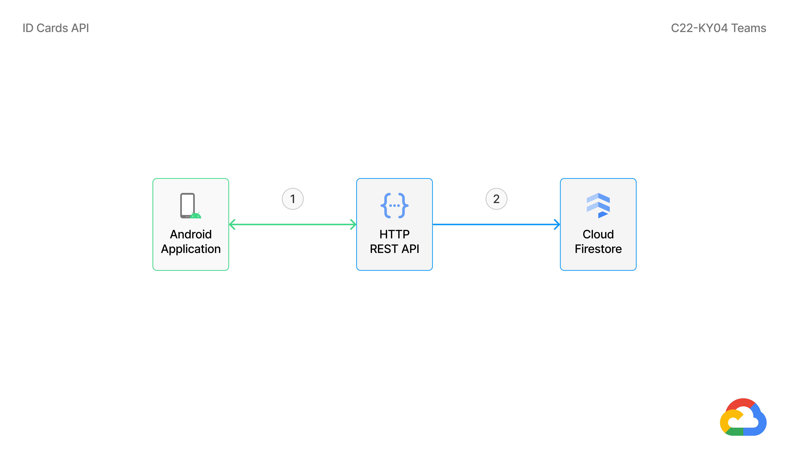

## Table of Contents

<details>
  <summary><b>(click to expand or hide)</b></summary>

  1. [Cloud Architecture Diagram](#cloud-architecture-diagram)
  1. [Billing Cost](#billing-cost)
  1. [Getting Started](#getting-started)
  1. [Securing a REST API with JWT](#securing-a-rest-api-with-jwt)
  1. [Optical Character Recognition API](#optical-character-recognition-api)
  1. [ID Cards API](#id-cards-api)
  1. [License](#license)

</details>

## Cloud Architecture Diagram


See more detail [here](https://www.figma.com/file/bXdu32FvMX29idjgUkxKXN/Google-Cloud-Diagram?node-id=0%3A1)

## Billing Cost
Estimated billing cost that's used in this projects:
<table>
  <tr>
    <td>Services</td>
    <td>Price</td>
  </tr>
  <tr>
    <td>Cloud Run</td>
    <td>IDR 0</td>
  </tr>
  <tr>
    <td>Cloud Storage</td>
    <td>IDR 33,502.95</td>
  </tr>
  <tr>
    <td>Cloud Build</td>
    <td>IDR 0</td>
  </tr>
  <tr>
    <td>Firestore</td>
    <td>IDR 11,187.07</td>
  </tr>
  <tr>
    <td>Total</td>
    <td>IDR 44,690.02</td>
  </tr>
</table>

See more detail [here](https://cloud.google.com/products/calculator/#id=05305aa6-1fa2-442f-9ebc-2b7ed1af4125)

## Getting Started

### Prerequisites

- Firebase project.
- Google Cloud Platform project and billing enabled.

### Setup

**Firebase:**

1. In the [Firebase Console](https://console.firebase.google.com/), click **Add project** to create a Firebase project.
1. Click **Authentication** from the **left hand menu**. Select **Sign-in method** tab and click **Add new provider**. Add provider for Email/Password, Google, and Facebook.
1. Select **Users tab** and click **Add user** to create a new user. Later this user will be used by the Cloud Computing team to generate tokens when testing REST API.
1. Click **Project Overview** from the **left hand menu**. Then click **Add app** to register Web Applications (only to generate token when testing REST API).
1. Click **Project settings** next to **Project Overview**. Then select **Service accounts** tab and click **Generate new private key**. Save it as `serviceAccountKey.json`.
1. Still in the **Project Settings**, select **Users and permissions** tab and click **Add member** to add the Mobile Development team so they can register Android App Applications.

**Google Cloud Platform:**

1. In the [Google Cloud Platform Console](https://console.cloud.google.com/), click **Navigation menu** > **Cloud Storage** > **Browser**.
1. Click **Create Bucket**. Set the following values, leave all other values at their defaults:

    - Name: id-cards-photo
    - Location type and Location: Region, asia-southeast2 (Jakarta)
    - Default storage class: Standard
    - Access control: Fine-grained

1. Click **Create**, then click **Browser** from the **left hand menu**. Check the bucket that was created earlier, then click three dots to the right of the bucket, then select **Edit access**.
1. Click **Add Principal**. Set the following values, leave all other values at their defaults:

    - New principals: allUsers
    - Role: Storage Object Viewer

1. Click **Save**, then click **Allow Public Access** when the popup appears.
1. Click **Navigation menu** > **Firestore**. Then click **Select Native Mode** button.
1. In the **Select a location** dropdown, choose **asia-southeast2 (Jakarta)**, then click **Create Database**.
1. In the top right toolbar, click the **Activate Cloud Shell** button.
1. From **Cloud Shell**, enable the **Container Registry**, **Cloud Build**, and **Cloud Run APIs**:

    ```shell
    gcloud services enable \
      containerregistry.googleapis.com \
      cloudbuild.googleapis.com \
      run.googleapis.com
    ```

1. Run the following command to clone this repository:

    ```shell
    git clone https://github.com/C22-KY04/cc-c22-ky04.git
    ```

1. Click **Open Editor** button on the **Cloud Shell Terminal** toolbar. Then upload the `serviceAccountKey.json` obtained from step 5 of Firebase setup to the root directory:

    - `cc-c22-ky04/id-cards-api`
    - `cc-c22-ky04/optical-character-recognition-api`

1. If you create a bucket with a different name from step 2 of the Google Cloud Platform setup, then replace the bucket name in the `cc-c22-ky04/optical-character-recognition-api/app.py` on line 44:

    ```Python
    # Replace with the name of the bucket you created
    bucket_name = "id-cards-photo"
    ```

1. Don't forget to change your **Google Cloud Platform Project ID** in the `deploy.sh` located at:

    - `cc-c22-ky04/id-cards-api/deploy.sh`
    - `cc-c22-ky04/optical-character-recognition-api/deploy.sh`

1. Run the following command to deploy Optical Character Recognition API to Cloud Run:

    ```shell
    cd ~/cc-c22-ky04/optical-character-recognition-api

    chmod +x deploy.sh

    ./deploy.sh
    ```

    Wait a few moments until the deployment is complete. Open the service URL in any browser window and you will get the result:

    ```json
    "Hello from Optical Character Recognition API, C22-KY04."
    ```

1. Click **Open Terminal** button on the **Cloud Shell Editor** toolbar. Run the following command to deploy ID Cards API to Cloud Run:

    ```shell
    cd ~/cc-c22-ky04/id-cards-api

    chmod +x deploy.sh

    ./deploy.sh
    ```

    Wait a few moments until the deployment is complete. Open the service URL in any browser window and you will get the result:

    ```json
    "Hello from ID Cards API, C22-KY04."
    ```

## Securing a REST API with JWT


Description:
1. Firebase Authentication will send JWT token to Android Application.
2. Android Application will send the JWT token to the Cloud Run Service. Then Cloud Run Service will validate the token, so only authenticated users can make requests.

## Optical Character Recognition API

Create REST API using [Python](https://www.python.org/), [Flask](https://flask.palletsprojects.com/en/2.1.x/), [TensorFlow](https://www.tensorflow.org), [PyTesseract](https://pypi.org/project/pytesseract/), [Cloud Run](https://cloud.google.com/run), and [Cloud Storage](https://cloud.google.com/storage)

### Workflow


Description:
1. Upload to Google Cloud Storage Bucket using HTTP Request Method `POST`.
2. Download images from Google Cloud Storage Bucket.
3. Classify images using TensorFlow, whether the image is ID card or not.
4. If the image is not an ID card (KTP), then immediately return the results to the Android Application.
5. If the image is an ID card (KTP), then proceed to collect the details.
6. Collect ID Card (KTP) details using PyTesseract (Python Tesseract).
7. Then send the results to the Android Application for re-validation.

### Base URL

https://ocr-api-5igfi42iaq-et.a.run.app

Response `string`

```json
"Hello from Optical Character Recognition API, C22-KY04."
```

### Routing

**POST** &nbsp;&nbsp; `/ocr`

This method allows you to classify an image as ID card or not and extract data on ID card.

Authentication

- [x] ID Tokens

Headers

<table>
  <tr>
    <td>Authorization</td>
    <td>string</td>
    <td>Bearer &lt;ID Tokens&gt;</td>
    <td><b>required</b></td>
  </tr>
</table>

Request Body &nbsp;&nbsp; `multipart/form-data`

<table>
  <tr>
    <td>file</td>
    <td>File</td>
    <td>png&nbsp;/&nbsp;jpg&nbsp;/&nbsp;jpeg</td>
    <td><b>required</b></td>
  </tr>
</table>

Response &nbsp;&nbsp; `application/json`

HTTP Response Status Codes  &nbsp;&nbsp; **201**

```json
{
    "status": "OK",
    "message": "Successfully extract data with OCR.",
    "data": {
        "province": "JAWA TIMUR",
        "district": "KABUPATEN SIDOARJO",
        "id_number": "351XXXXXXXXXXXXX",
        "name": "MOCHAMMAD ARYA SALSABILA",
        "place_date_of_birth": "SIDOARJO, 24-06-2001",
        "gender": "LAKI-LAKI",
        "blood_type": "-",
        "address": "NGABAN",
        "neighborhood": "005/002",
        "village": "NGABAN",
        "subdistrict": "TANGGULANGIN",
        "religion": "ISLAM",
        "marital_status": "BELUM KAWIN",
        "occupation": "PELAJAR/MAHASISWA",
        "nationality": "WNI",
        "expiry_date": "SEUMUR HIDUP",
        "attachment": "https://storage.googleapis.com/id-cards-photo/04062022-090807.png"
    }
}
```

HTTP Response Status Codes  &nbsp;&nbsp; **400**

```json
{
    "status": "Bad Request",
    "message": "No token provided."
}
```

```json
{
    "status": "Bad Request",
    "message": "No file part."
}
```

```json
{
    "status": "Bad Request",
    "message": "No selected file."
}
```

HTTP Response Status Codes  &nbsp;&nbsp; **406**

```json
{
    "status": "Not Acceptable",
    "message": "Only files with extension png, jpg, jpeg are allowed."
}
```

```json
{
    "status": "Not Acceptable",
    "message": "That's not an Indonesian ID Card (KTP). Please try again."
}
```

HTTP Response Status Codes  &nbsp;&nbsp; **500**

```json
{
    "status": "Internal Server Error",
    "message": "Error message..."
}
```

## ID Cards API

Create a REST API using [Node.js](https://nodejs.org/en/), [Express](https://expressjs.com/), [Firebase Auth](https://firebase.google.com/products/auth), [Cloud Run](https://cloud.google.com/run), and [Cloud Firestore](https://cloud.google.com/firestore).

### Workflow



Description:
1. Android Application performs the HTTP Request Method to the HTTP REST API. Some of the methods that can be used are:
    - `POST` to save ID Card (KTP) details.
    - `GET` to retrieve entire ID Cards, or retrieve some ID Cards by name.
2. If the HTTP Request Method sent is `POST`, the ID Card (KTP) details will be saved to Cloud Firestore.

### Base URL

https://id-cards-api-yil5spdsaq-et.a.run.app

Response `string`

```json
"Hello from ID Cards API, C22-KY04."
```

### Routing

**POST** &nbsp;&nbsp; `/id_cards`

This method allows you to save ID Card details.

Authentication

- [x] ID Tokens

Headers

<table>
  <tr>
    <td>Authorization</td>
    <td>string</td>
    <td>Bearer &lt;ID Tokens&gt;</td>
    <td><b>required</b></td>
  </tr>
</table>

Request Body &nbsp;&nbsp; `application/json`

```json
{
    "province": "JAWA TIMUR",
    "district": "KABUPATEN SIDOARJO",
    "id_number": "351XXXXXXXXXXXXX",
    "name": "MOCHAMMAD ARYA SALSABILA",
    "place_date_of_birth": "SIDOARJO, 24-06-2001",
    "gender": "LAKI-LAKI",
    "blood_type": "-",
    "address": "NGABAN",
    "neighborhood": "005/002",
    "village": "NGABAN",
    "subdistrict": "TANGGULANGIN",
    "religion": "ISLAM",
    "marital_status": "BELUM KAWIN",
    "occupation": "PELAJAR/MAHASISWA",
    "nationality": "WNI",
    "expiry_date": "SEUMUR HIDUP",
    "attachment": "https://storage.googleapis.com/id-cards-photo/u10rFTlsFwSaeAJ3d6DhcaCZqWX2.png"
}
```

Response &nbsp;&nbsp; `application/json`

HTTP Response Status Codes  &nbsp;&nbsp; **201**

```json
{
    "status": "Created",
    "message": "The item/record was created successfully."
}
```

HTTP Response Status Codes  &nbsp;&nbsp; **400**

```json
{
    "status": "Bad Request",
    "message": "No token provided."
}
```

```json
{
    "status": "Bad Request",
    "message": "Error message..."
}
```

HTTP Response Status Codes  &nbsp;&nbsp; **401**

```json
{
    "status": "Unauthorized",
    "message": "You do not have permissions to access the service."
}
```

**GET** &nbsp;&nbsp; `/id_cards`

This method allows you to retrieve the entire ID Cards / retrieve some ID Cards by name.

Authentication

- [x] ID Tokens

Headers

<table>
  <tr>
    <td>Authorization</td>
    <td>string</td>
    <td>Bearer &lt;ID Tokens&gt;</td>
    <td><b>required</b></td>
  </tr>
</table>

Query String

<table>
  <tr>
    <td>name</td>
    <td>string</td>
    <td>Pass a text query to search</td>
    <td>optional</td>
  </tr>
</table>

Response &nbsp;&nbsp; `application/json`

HTTP Response Status Codes  &nbsp;&nbsp; **200**

```json
{
    "status": "OK",
    "message": "The items/records was retrieved successfully.",
    "data": [
        {
            "province": "JAWA TIMUR",
            "district": "KABUPATEN SIDOARJO",
            "id_number": "351XXXXXXXXXXXXX",
            "name": "MOCHAMMAD ARYA SALSABILA",
            "place_date_of_birth": "SIDOARJO, 24-06-2001",
            "gender": "LAKI-LAKI",
            "blood_type": "-",
            "address": "NGABAN",
            "neighborhood": "005/002",
            "village": "NGABAN",
            "subdistrict": "TANGGULANGIN",
            "religion": "ISLAM",
            "marital_status": "BELUM KAWIN",
            "occupation": "PELAJAR/MAHASISWA",
            "nationality": "WNI",
            "expiry_date": "SEUMUR HIDUP",
            "attachment": "https://storage.googleapis.com/id-cards-photo/u10rFTlsFwSaeAJ3d6DhcaCZqWX2.png"
        },
        {
            "province": "JAWA TIMUR",
            "district": "KABUPATEN SIDOARJO",
            "id_number": "351XXXXXXXXXXXXX",
            "name": "MOCHAMMAD ARYA SALSABILA",
            "place_date_of_birth": "SIDOARJO, 24-06-2001",
            "gender": "LAKI-LAKI",
            "blood_type": "-",
            "address": "NGABAN",
            "neighborhood": "005/002",
            "village": "NGABAN",
            "subdistrict": "TANGGULANGIN",
            "religion": "ISLAM",
            "marital_status": "BELUM KAWIN",
            "occupation": "PELAJAR/MAHASISWA",
            "nationality": "WNI",
            "expiry_date": "SEUMUR HIDUP",
            "attachment": "https://storage.googleapis.com/id-cards-photo/u10rFTlsFwSaeAJ3d6DhcaCZqWX2.png"
        }
    ]
}
```

HTTP Response Status Codes  &nbsp;&nbsp; **400**

```json
{
    "status": "Bad Request",
    "message": "No token provided."
}
```

```json
{
    "status": "Bad Request",
    "message": "Error message..."
}
```

HTTP Response Status Codes  &nbsp;&nbsp; **401**

```json
{
    "status": "Unauthorized",
    "message": "You do not have permissions to access the service."
}
```

HTTP Response Status Codes  &nbsp;&nbsp; **404**

```json
{
    "status": "Not Found",
    "message": "The item/record not found."
}
```

## License

Distributed under the MIT License. See `LICENSE` for more information.
